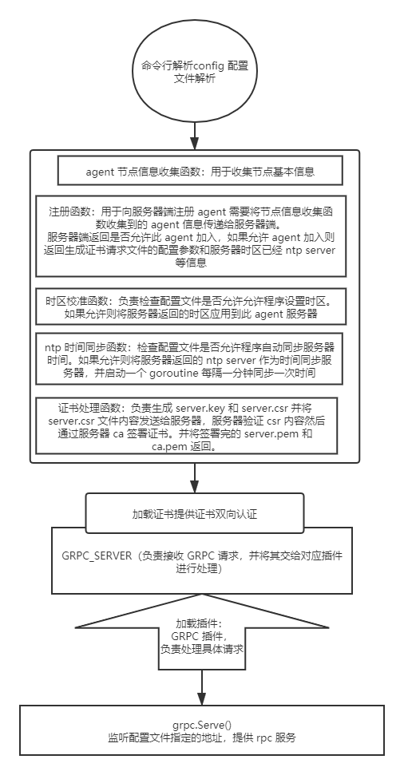

"hi devops apiserver" 



```bash
[root@localhost ~]# ./apiserver
[root@localhost ~]# ./apiserver -s stop
```

#### /etc/devops/hi-devops-agent.ini
```ini 
[global]
# 服务器地址
server = "http://192.168.3.100:8888" 

# agent 工作目录
workdir = "/opt/hi-devops-agent/"

# agent grpc 监听地址
address = "0.0.0.0:8088"

# 是否以守护进程方式运行
daemon = true
pidfile = "./daemon.pid"
logfile = "./daemon.log" 

# 是否允许程序设置系统时间
settime = true

# 是否允许程序设置系统时区
setzone = true
```
